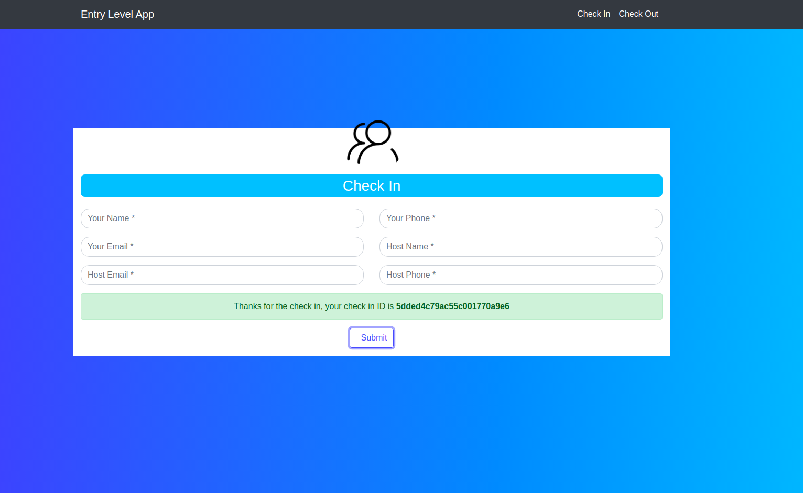

# ENTRY MANAGEMENT APPLICATION

The project aims at creating a software that allows visitor to check-in and check-out during their visit to a company.
This project has two main folders namely reactcode and entry-level-api. reactcode contains the frontend part and entry-level-api contains the backend part.
The app has been deployed on Heroku and can be accessed [here]([https://entry-level.herokuapp.com/check-in](https://entry-level.herokuapp.com/check-in)). 

## Pre-Requisites
* NodeJs should be installed on your system
* Mongodb should be installed on your system
* ReactJs should be installed on your system
* A Gmail Account
* Account on MongoDB website
* Account on Heroku 
* Fast2SMS unique api key
* Read the  Installing Dependencies and Starting the project section below carefully before usage.

## Technology Stack

**Frontend**
* HTML 
* CSS
* JavaScript
* ReactJs
* Bootstrap

**Backend**
* NodeJs
* ExpressJs

 **Database**
 * MongoDB(Cluster from Mongodb Atlas)
 
 **APIs**
 * Fast2SMS(Rs 50 free SMS) - for sending SMS
 * NodeMailer - for sending emails

## Deployment
The app has been deployed on Heroku and can be accessed [here]([https://entry-level.herokuapp.com/check-in](https://entry-level.herokuapp.com/check-in)).

## Installing Dependencies
To run the app locally follow the below steps : 
* Clone the repository.
* Move to reactnode folder and execute the following:
```
npm install
```
* Move to entry-level-api folder and execute the following:tart
```
npm install
```
* You need to update the e-mail id and password in users.controller.js :
```
cd Summergeeks-20/entry-level-api/controllers/users.controller.js
```
Add gmail account and password for sending E-mails via node-mailer in nodemailer.createTransport function
```
user: 'ENTER E-MAIL ID',                                
pass: 'ENTER YOUR PASSWORD'
```
and  ``from``  option in  ``sendMail()`` function in ``users.controller.js`` file update

```
from: '"YOUR NAME" <ENTER E-MAIL ID>'
```
* Finally, for SMS functionality enter your own ``Fast2SMS api key`` in ``.env`` file in entry-level-api folder :
```
SMS_API_KEY = ENTER YOUR OWN SMS API KEY
```


## Starting the Project
* In react node folder run:
```
npm start
```
* It will start the react website.

* In entry-level-api folder run:
```
node app.js
```
* It will start the server at http://localhost:5000
* Open .env file inside reactcode folder, change the value of REACT_APP_API_URL to http://localhost:5000/api.

## Implementation

* On Landing page we have a check in form, where visitor can enter his own details and host details.
* After clicking on submit button it will call an API [Node JS] that will read the information from the check-in form [we are sending the data using POST method].
* API function will receive the request and get the data from the request and validate it in defined manner. After that it will check that this visitor is checking in again without doing check out or not. If already checked-in then, it will return an error saying already checked-in.
* If this visitor is new then api will go further for inserting the data into MongoDB database collection [entries]. It returns full data of particular request [visitor details]. MongoDB returns a unique ID that will be used as check in ID.
* If the visitor wants to check out then he has to click on check out link on website, then it will ask him to enter unique check in ID.
* After clicking on submit button, we are calling an API to check and get data form provided check in ID.
* In API side it receives the request for the route /api/users/checkin/{ID}. It will check the id, if it is invalid or not. If ID is valid then API will get data from mongoDB collection using this unique ID. it will return the data to the API requester [Web].
* Then we are showing the yes [Requester Name] (HOST NAME), Do you want to check out?
* If again visitor click on submit button then it will send the data to server using API. API will get the data from this route /api/users/checkin/{ID}, now it will check if visitor is already checked out or not. If already checked out then it will return an error saying already checked-out. If first time checking-out, then API will update the check out time and send email and sms to visitor about details.

### Setting up of MongoDB Database
* First of all account is create on the website.
* Created a cluster using monodb online db.
* Created a user
* Give permission to readWriteAnyDatabase
* Write 0.0.0.0 in network access(allow from anywhere).
* Created a database, inside that collection say entries have been created.
* Got a connection string (srv) to connect from code in app.js. 

## Workflow

**Landing Page**
* Browse to the url [https://entry-level.herokuapp.com/check-in](https://entry-level.herokuapp.com/check-in) to see the landing page.


**Check-In Process**
* The moment you enter the landing page url into your browser a check-in form appears on your screen. Visitor needs to fill all the details in order to check-in. If user submit anything in inappropriate format or keeps ant field empty then he/she will see an alert on the check in page telling him about what went wrong. If all the details are submitted correctly visitor is able to successfully check-in. A unique check-in ID will be generated and displayed on screen and also will be sent to visitor on email and sms for the check-out purpose. Host will receive details of the visitor on his email and sms.




**Check-Out Process**
* Click the check-out button in top right corner to navigate to check-out page. There a check-out form appears that requires visitor to enter their unique check-in ID generated a time of check-in(also sent through email and sms). If the check-in ID entered by user is correct it will ask him if he is sure to check-out and if user clicks yes, he is successfully checked-out. But if there is any error in check-in ID then that error would be displayed to user. The check-out details are sent to the visitor through email and sms,


**Some Corner Cases**
* If visitor tries to check-in with same email-id and phone no. with which he has checked-in before but hasn't checked-out by then then it will throw error to the user.
 
 
 * If the visitor has checked-out but tries to check-out again with same unique check-in ID then error will be displayed to him.
 

## Database Schema
 Schema model


 Entry in Database
 


## Folder Structure


